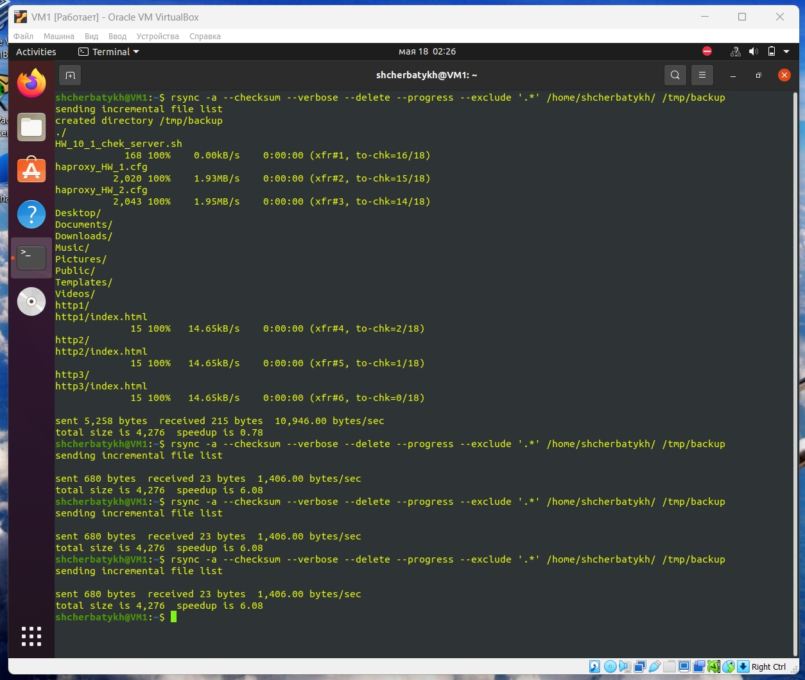
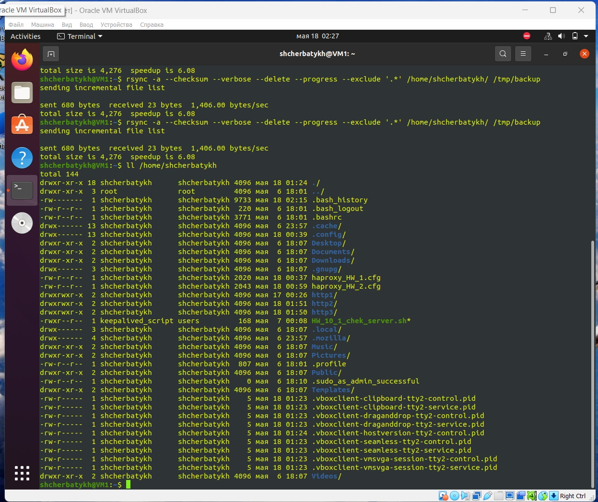
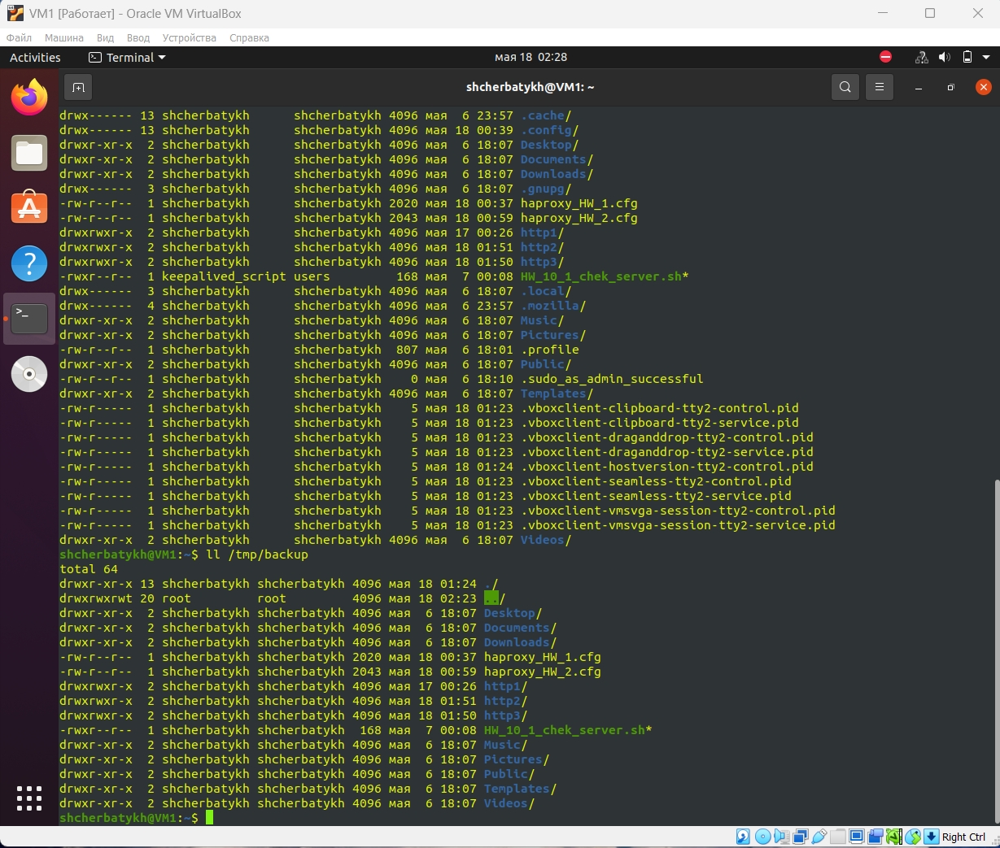
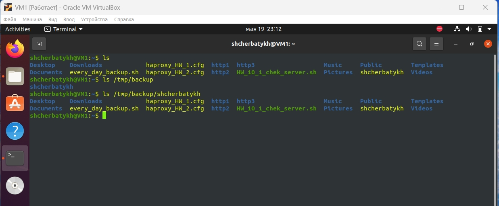
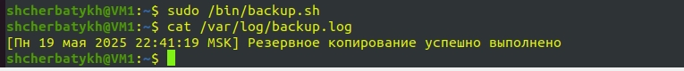
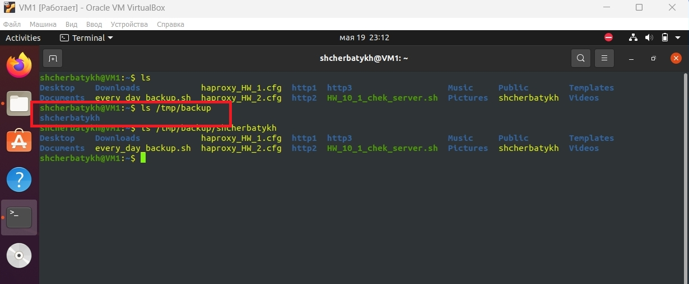
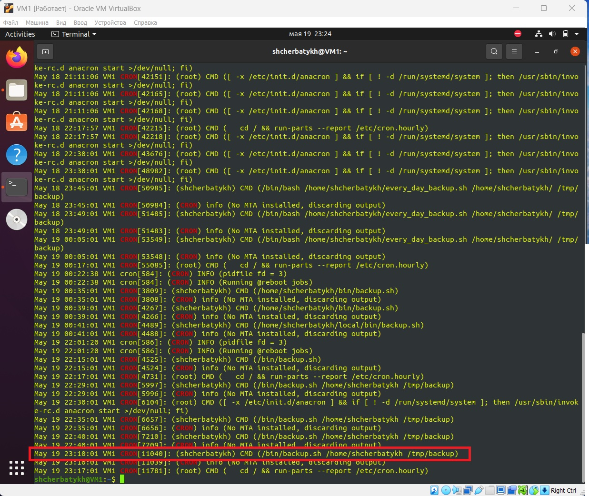

# Домашнее задание к занятию "Резервное копирование" - `Щербатых А.Е.`

## Задание 1
1. Составьте команду rsync, которая позволяет создавать зеркальную копию домашней директории пользователя в директорию /tmp/backup
2. Необходимо исключить из синхронизации все директории, начинающиеся с точки (скрытые)
3. Необходимо сделать так, чтобы rsync подсчитывал хэш-суммы для всех файлов, даже если их время модификации и размер идентичны в источнике и приемнике.
4. На проверку направить скриншот с командой и результатом ее выполнения

## Выполнение
команда `rsync -a --checksum --verbose --delete --progress --exclude '.*' /home/shcherbatykh/ /tmp/backup`

 
 
 

## Задание 2
1. Написать скрипт и настроить задачу на регулярное резервное копирование домашней директории пользователя с помощью rsync и cron.
2. Резервная копия должна быть полностью зеркальной
3. Резервная копия должна создаваться раз в день, в системном логе должна появляться запись об успешном или неуспешном выполнении операции
4. Резервная копия размещается локально, в директории `/tmp/backup`
5. На проверку направить файл crontab и скриншот с результатом работы утилиты.

## Выполнение
1. Скрипт [backup.sh](files/backup.sh)
Cron-файл [cron](files/shcherbatykh)
2. Резервная копия зеркальна по отношению к оригиналу

   
3. Запись в логе

    
4. Резервная копия размещается в директории `/tmp/backup`

    

Проверка работы cron-файла (запись в системном логе)

 
